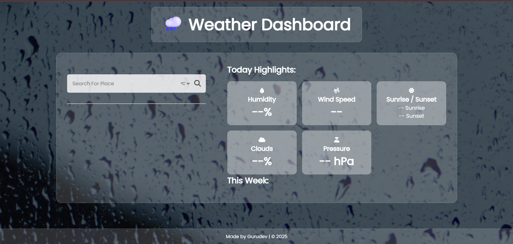

# Weather

A modern, visually appealing weather app that provides current weather data, highlights, and a 5-day forecast — all with a dynamic video background and glassmorphism design.

### 🌤️ Main Dashboard


## 🚀 Features

- 🌍 Search weather by city name
- 🌡️ Toggle between °C and °F
- 🕐 Local sunrise & sunset times
- 🌧️ Live 5-day forecast
- 💨 Humidity, wind speed, pressure & cloud data
- 🎬 Rainy video background with animated raindrops
- ✨ Glassmorphic design with responsive layout

## 🛠️ Tech Stack

- **HTML5**, **CSS3**, **JavaScript**
- **OpenWeatherMap API**
- **Font Awesome** icons
- **Responsive Design**

## 📦 Setup Instructions

1. Clone the repository:
   ```bash
   git clone https://github.com/gurudev-1113/Weather.git
   cd Weather
Open index.html in your browser.

To test forecast features, replace the API key in script.js if needed:

js
Copy
Edit
const API_KEY = "your_api_key_here";
Add your own video background if preferred. Replace rainy.mp4.

🔑 Get an API Key
Sign up at https://openweathermap.org to get your free API key.

📸 Screenshot
(Optional — Add screenshots of your project here)

🙌 Author
Made with ❤️ by Gurudev
GitHub

yaml
Copy
Edit

---

### 📝 To add this file:

1. **Create the file** in your project folder:

```bash
notepad README.md